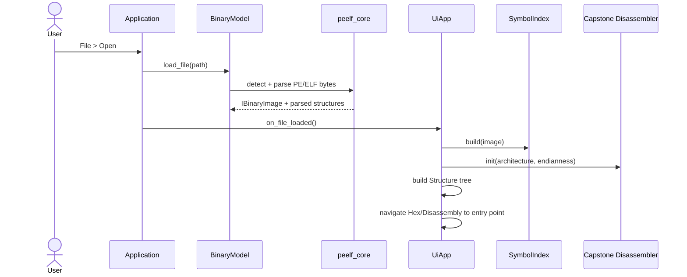
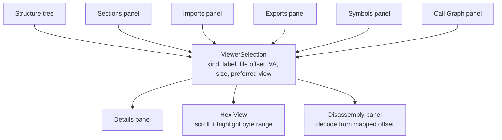
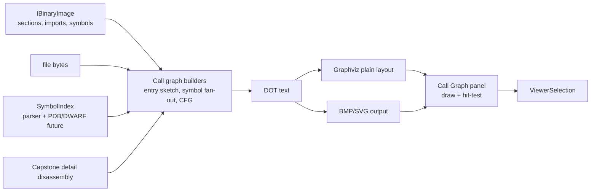
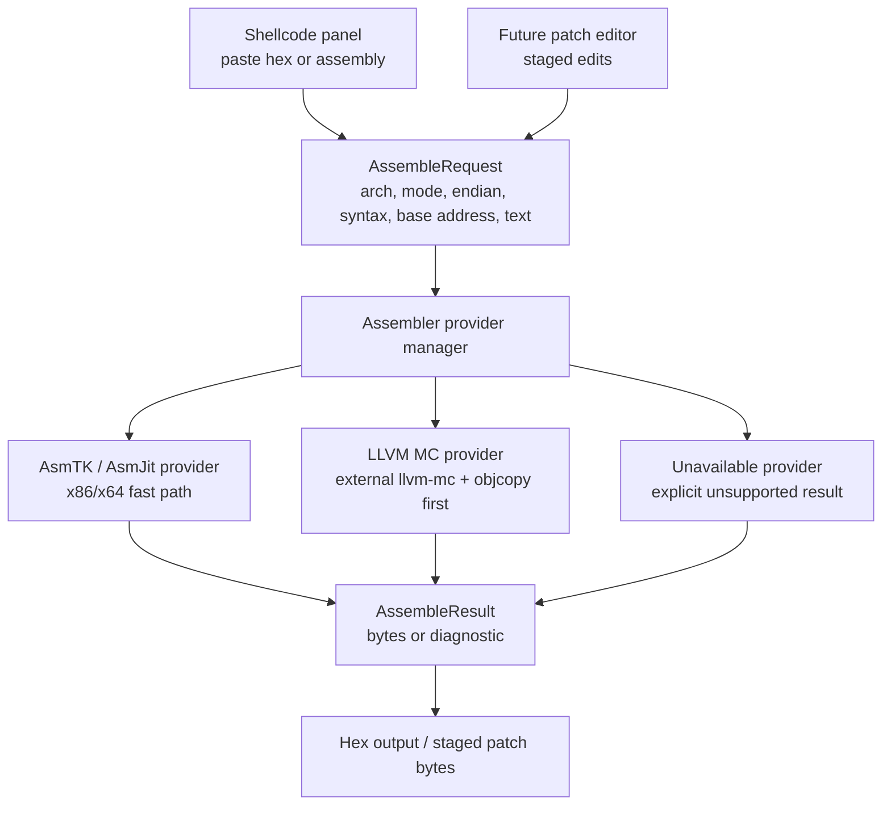
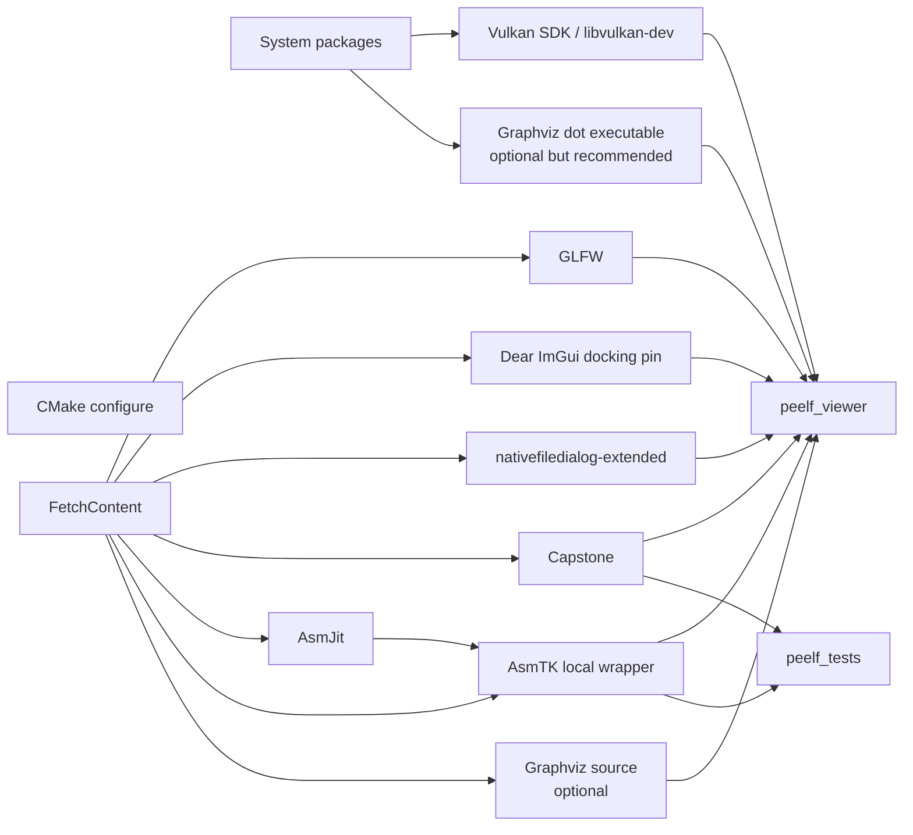
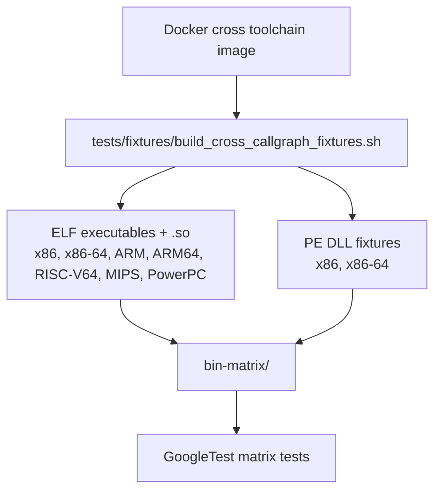

# PE / ELF Explorer Architecture

This document describes the current shape of the project. It is intentionally
practical: the diagrams show how code and data move today, plus the provider
boundaries we are adding for assembler/decompiler/live-process work.

## Runtime Shape

```mermaid
flowchart LR
    user["User"]
    app["peelf_viewer<br/>Application"]
    ui["UiApp<br/>Dear ImGui panels"]
    model["BinaryModel<br/>loaded file bytes + parsed image"]
    core["peelf_core<br/>PE / ELF parsers"]
    disasm["Capstone wrapper<br/>Disassembler"]
    symbols["SymbolIndex<br/>parser symbols + debug symbols"]
    graph["CallGraph model<br/>entry / fan-out / CFG work"]
    graphviz["Graphviz dot<br/>external renderer"]
    vulkan["VulkanManager<br/>textures + ImGui backend"]

    user --> app
    app --> ui
    app --> model
    model --> core
    ui --> model
    ui --> disasm
    ui --> symbols
    ui --> graph
    graph --> graphviz
    graphviz --> graph
    graph --> vulkan
    ui --> vulkan
```

## Static File Load Flow



## Panel Navigation Model



Selections are the core UI contract. A panel should update `ViewerSelection`
instead of directly rewriting unrelated panels. `UiApp` then maps the selection
to Details/Hex/Disassembly when readable bytes exist. Selections without readable
bytes should remain valid and display a clear "hex not available" style message
as that path is hardened.

## Call Graph Flow



The current UI renders a graph and uses Graphviz `plain` metadata for node
hit-testing. Clicking a function-like node updates the shared selection and can
queue a new fan-out graph rooted at that symbol. The next major step is richer
basic-block CFG construction and more precise indirect-call handling.

## Assembly / Patch Provider Direction



AsmJit/AsmTK is now available as `peelf::asmtk` and has a smoke test proving
x64 `nop; ret` assembly. The provider wrapper is still pending. Unsupported
architectures must return an explicit unsupported/unavailable result so the UI
can show a useful message instead of failing silently.

## Dependency Shape



`peelf::asmtk` and `peelf::graphviz` are stable project-facing targets. Their
feature macros report whether the backing implementation/tool is available.

## Test Fixture Matrix



The checked-in `bin-matrix/` files let normal builds run parser, symbol,
disassembly, and call-graph tests without regenerating fixtures. The Docker
targets refresh the matrix when cross-toolchain coverage changes.
